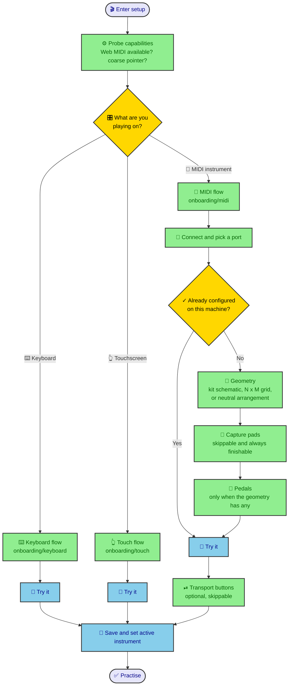
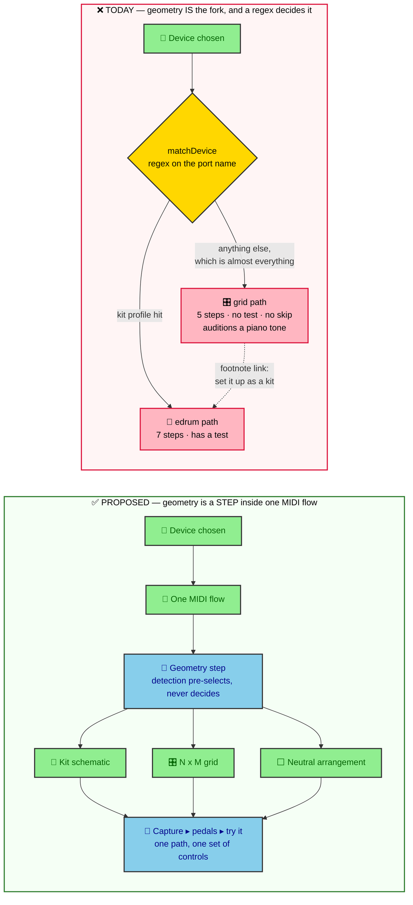
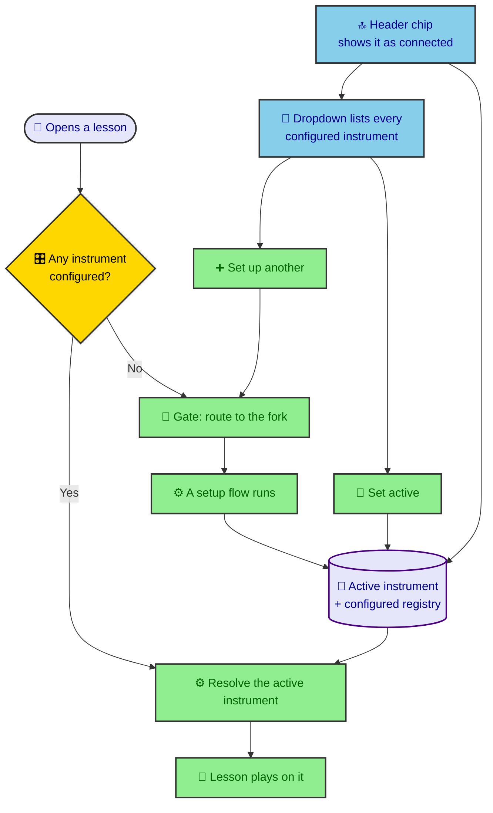

## Context

See [proposal.md](./proposal.md) — Why. What matters for the approach:

- `src/routes/onboarding/+page.svelte` is 2,233 lines holding a flat
  `Step` union of ten values and a `Path` union of four, with per-path
  conditionals (`isKit ? … : …`, `path === 'known'`) inside almost every screen.
  There is no seam to extend; there is only a seam to split along.
- `$lib/controller.svelte.ts` is already the facade over "what the student's
  instrument is". Nothing outside it parses a stored config or interprets raw
  MIDI, and `Controller.list()` already enumerates configured instruments. The
  revamp is mostly a _routing and presentation_ change, not a model change.
- `/lessons/[id]` already resolves a playable input on mount:
  `selectedId = savedDevice ?? (coarse ? VIRTUAL_TOUCH_ID : VIRTUAL_KEYBOARD_ID)`.
  So the capability logic this design needs exists — in the wrong place, and
  duplicated by a wizard that ignores it.
- Storage is per `deviceId` under `groove-master:<deviceId>`, with
  `groove-master:selectedDevice` naming the last choice. Virtual sources use
  reserved ids containing `:` so `Controller.list()` skips them.
- **MIDI access is never awaited** (`CLAUDE.md`): the permission prompt can stay
  pending indefinitely and must not hold up playback. Anything the fork screen
  does with Web MIDI inherits that constraint.

Diagram sources live in [`diagrams/`](./diagrams/) and were validated with
`mmdc` before being embedded here.

## Goals / Non-Goals

**Goals:**

- One screen where the student states the instrument, and detection that only
  ever pre-selects an answer.
- Three flows — keyboard, touchscreen, MIDI — each addressable, each ending in
  the same try-it step, each reachable in one click from the fork.
- Geometry (schematic / grid / neutral) as a step inside the MIDI flow.
- One authority for "which instrument is active" and "is anything configured",
  read by the header, the gate and the lesson page alike.
- No flow that can trap the student, and no primary CTA that cannot work.

**Non-Goals:**

- Raising `MAX_COLS` / `MAX_ROWS` beyond 4×4. Real, but a separate change.
- Adding kit profiles. The generic geometry is what makes the MIDI flow work for
  unlisted kits; shipping more profiles is content, not structure.
- Changing scoring, the highway, or `Controller.handle()` semantics.
- Cloud-syncing the active instrument. It stays device-local, like the kit choice.
- Rewriting `controller-preview.svelte`. It already renders every geometry.

## Decisions

### 1. The fork is a screen, and detection is demoted to a default

A first step asks "what are you playing on?" with three choices. `matchDevice()`
survives, but only to pre-select the _geometry_ once a MIDI port is chosen — it
never picks a flow and never picks a path.

_Alternative considered — better detection._ Ship more kit profiles and widen
the regexes so the guess is usually right. Rejected: the failure is structural,
not a coverage gap. A port string is not a reliable statement about an
instrument (the shipped MD-90 announces itself as `"e-drum"` by `"Medeli"`), and
a wrong guess is expensive precisely because it is silent.

_Alternative considered — capability-only auto-routing._ Route on
`requestMIDIAccess` presence and `(pointer: coarse)` with no question at all.
Rejected: capability says what the _browser_ can do, not what the student _has_.
A laptop with Web MIDI and no controller would be routed to the MIDI flow.

Capability probing **orders and annotates** the three cards; it never hides or
disables the chosen one. All three stay selectable, because a student who
connects a controller after landing on a phone-shaped screen should not have to
find a hidden option. What changes is which card is primary and what the
secondary cards say about themselves ("needs Chrome, Edge or Opera").

The probe is synchronous — `typeof navigator.requestMIDIAccess === 'function'`
and `matchMedia('(pointer: coarse)')`. It never calls `requestMIDIAccess()`, so
the fork cannot be blocked by a pending permission prompt.

**This binds the header chip too**, which is the non-obvious consequence: the chip
renders on every page, the fork included, so a chip that asked for access in order
to report "connected" would violate this rule from the one screen that must not.
Hence the three-state chip in decision 6 — present / absent / **unknown** — rather
than a two-state one. Reporting "configured" without a presence claim is the
honest answer when nobody has been granted access yet, and it is the common case
on a first visit.

### 2. Three flows plus a geometry, not four flows

A grid of pads is a MIDI instrument whose pads have no picture. Everything that
distinguished the `grid` path — `cols`/`rows`, and `playScaleTone` instead of a
drum — is either a geometry parameter or a bug.

Consequences worth naming, because each removes a live defect:

- **Skip and early-Done stop being `isKit`-gated.** One capture loop, one footer.
  The grid dead end disappears as a side effect of there being one path.
- **Capture auditions the drum.** `playScaleTone` leaves the wizard entirely;
  `audition()` collapses to `drums()?.play(kitId, pad.sound)`. A pad grid is
  drums, so setup should sound like drums.
- **Pedals appear only when the geometry has a pedal pad**, which is already what
  `gestures` derives — it stops being "a kit step" and becomes a conditional step.
- **`adoptGmSound()` loses its `isKit` guard.** A GM-mapped grid is telling us the
  same truth a GM-mapped module is.
- **The `captureIndex` / `padIndex` bug must be fixed here**, not later. Today the
  map step reads `controller.pads[captureIndex]` while every other read goes
  through `padIndex = captureOrder[captureIndex]`. It is invisible only because
  the one shipped profile puts its pedal pad last. Generic geometries let a
  student put a pedal anywhere, so the divergence becomes reachable the moment
  this change lands.

### 3. "Already configured" is an entry condition, not a path

`known` leaves the `Path` union. Each flow asks, on entry, whether the instrument
it is about is already configured; if it is, the flow opens at try-it with the
stored mapping loaded. Re-map is a control on try-it, as it is today.

_Why:_ `known` is not an instrument, and modelling it as a peer of `grid` and
`edrum` is what produced `path === 'known'` branches in `finishTest()` and in the
pedals and transport Back targets. As an entry condition it is one predicate —
`Controller.load(id)?.pads.some(p => p.note != null)` — evaluated once per flow.

This also generalises the shortcut the spec currently grants only to MIDI: a
keyboard student who has edited their mapping should land on try-it too, not on
the mapping editor.

### 4. Try-it is the shared terminal step, and the only mandatory one

Every flow ends at try-it: play freely, hits light their pad and are named,
unmapped input is reported rather than ignored. Mapping editors, geometry,
pedals and transport all become steps a student can pass through or skip.

_Why:_ it is the only step that answers "will this work?", and it is currently
the one step two of the three flows lack. Touch and keyboard need it most —
mapping is pre-correct there, so _feel_ is the only open question, and today
there is nowhere to feel it. Making it shared also gives the entry condition in
decision 3 a well-defined landing place.

For the virtual flows, try-it must exercise the **real** playing surface
(`virtual-pads.svelte` for touch, live `keydown` for keyboard), not a preview
that merely looks like it. A preview that responds differently from the lesson is
worse than no preview.

### 5. Setup gates practice, and the gate is one click deep

Entering a lesson with nothing configured routes to the fork. The gate is
deliberately cheap: from the fork, keyboard and touch reach a playable,
already-mapped instrument in a single choice, so the gate costs one click rather
than a setup session.

_Why gate at all,_ when `/lessons/[id]` already auto-selects a virtual source?
Because the auto-selection is invisible. A student practising on the on-screen
pads never learns that is what happened, never sees the mapping, and has no idea
a controller would be recognised — and the homepage already promises a setup step
that the lesson page quietly makes redundant. Gating makes the implicit choice
explicit exactly once.

_Alternative considered — no gate, keep auto-selection._ Rejected per the
decision above, but the reason it was tempting is worth keeping: the gate must
never be a wall. Hence "one click deep", and hence the gate firing only when
_nothing at all_ is configured — never on a device that has an instrument but not
the one currently plugged in.

### 6. One authority for the active instrument

`selectedDevice` becomes a small reactive module — the natural home is alongside
`Controller` in `$lib/controller.svelte.ts`, which already owns persistence and
the registry — exposing:

- the active instrument's id and summary,
- whether anything is configured at all (what the gate reads),
- a setter that persists and notifies.

Resolution order stays explicit: an in-session choice, then the persisted
`selectedDevice`, then — only when nothing is configured — nothing, because that
is the gate's trigger. The `(coarse ? touch : keyboard)` fallback moves _out_ of
`/lessons/[id]`'s `onMount` and into the fork's card ordering, where it is a
suggestion the student can see and override rather than a silent default.

The header chip is the _visible_ half of that state. It shows the active
instrument as connected, and its dropdown lists the configured instruments plus
"set up another", which re-enters the fork. Two things it must get right:

- **Connected is not the same as configured**, and _unknown_ is a third state, not
  a failure. Presence can only be read from a `MIDIAccess` someone already holds;
  the chip must never request one (decision 1). With no access held it says
  "configured" and claims nothing about the cable. Virtual sources need no access
  to observe, so they are always present.
- **A run-in-progress flag lives in the same store.** The chip must refuse to
  switch instrument mid-run, but `playing`/`paused` are local state in
  `/lessons/[id]` and the chip is in the layout — there is no existing signal
  between them. The flag is set when a scored run starts and cleared when it ends
  or its page is left; a paused run still counts, because its scoring is open.
- The lesson page's own input chooser and the header dropdown must not disagree.
  They become two views of one store; the lesson page's chooser stops owning the
  choice.

### 7. A route per flow

`/onboarding` becomes the fork; `/onboarding/keyboard`, `/onboarding/touch` and
`/onboarding/midi` are the flows. This makes each flow linkable and resumable,
and it forces the 2,233-line component apart along boundaries that already exist,
rather than adding a fourth `path` value to a union that is already the problem.

The step rail then derives from the active flow only — which is what fixes it
lying on the first screen today, where `path` defaults to `'grid'` and promises
five steps to a student who may walk two.

**Where the page's shared side effects go.** The wizard has one `onMount` doing
five unrelated things and one `$effect` reporting the step; the card shell
extracted in group 1 is presentational and must own none of it, so nothing moves
until the routes exist. Splitting them by their real owner:

| today                            | owner after the split                                                                                                                                    |
| -------------------------------- | -------------------------------------------------------------------------------------------------------------------------------------------------------- |
| `onboardingStarted()`            | the onboarding **layout** — once per setup visit, whichever flow is taken                                                                                |
| step reporting `$effect`         | the **layout**, keyed off the route plus the in-flow step                                                                                                |
| drums manifest → `drumNames`     | the **layout** — try-it needs it in all three flows, so fetching it per flow would refetch it                                                            |
| `known = Controller.list()`      | the **MIDI flow** — its only reader is the port list's "set up already" badge                                                                            |
| `midi.onNote` / `midi.onMessage` | the **MIDI flow**                                                                                                                                        |
| the global `keydown`             | the **keyboard flow** — today it is gated on `step === 'sounds'` and the keyboard id, and in a shared layout it would fire on the fork and the MIDI flow |

The hub itself is the awkward one: one `MidiHub` serves the whole wizard today,
and a hub per route loses `midi.access` — the granted permission — when the
student moves fork → MIDI → fork, re-prompting them. So the hub becomes a module
singleton rather than a component field.

### 8. `edrum-setup` keeps its capability name

The capability now describes the whole MIDI flow, so the name reads oddly. It is
kept anyway: renaming a spec directory churns history for a cosmetic gain, and
the Purpose section is rewritten to say what it now covers. Revisit only if a
future change splits it.

## Risks / Trade-offs

- **The gate annoys a returning student whose storage was cleared** (private
  window, cleared site data) → the gate is one click from playable, and the fork
  remembers nothing it needs to. Accepting one extra click here is the price of
  the choice being explicit at all.
- **A pending MIDI permission prompt could stall the fork** → the probe is
  synchronous and never calls `requestMIDIAccess()`. Only the MIDI flow requests
  access, and it inherits the existing never-await rule.
- **The header chip crowds the collapsed nav at 320px** → the chip must degrade to
  an icon-plus-dot before the header wraps, and `responsive-layout` already
  forbids the header wrapping instead of collapsing. Verify at 320px, not 390px.
- **Unifying the capture loop could regress hi-hat classification**, which is the
  subtlest thing in the wizard and the easiest to break silently — a stateful
  pedal may emit a hundred-odd messages during a single sweep (137 on the unit
  the current code was written against), and the classifier depends on reading
  the raw stream in the right step → `classifyHihat()` and `pedalMessage()` move
  unchanged; only the step that hosts them changes. Pedal traffic must stay
  control-not-performance, per the `controller` spec.
- **The capture debounce is shared mutable state**, and splitting the loop out is
  exactly what exposes it: `lastNote`/`lastAt` are read by both `captureNote` and
  `pedalNote` and reset only in `startCapture`. Move them into the capture
  component and the pedals step inherits a stale `lastNote` — the first pedal
  gesture matching the last captured pad's note is swallowed as a bounce, which
  looks like a dead footswitch → move the debounce state wholesale into the
  capture component and give `pedalNote` its own copy, in the same commit.
- **Losing the `4×4` fast default** for the grid geometry → detection still
  pre-selects `cols`/`rows` from a matched preset; the geometry step opens on the
  suggestion, so a recognised MPD218 is still two clicks from capture.
- **Three flows plus geometry is a bet that the geometry step reads clearly** to
  someone who does not know what "geometry" means. The step must be phrased as a
  picture-choice ("which of these looks like yours?"), not as a taxonomy.
- **Splitting one component into four routes duplicates layout chrome** → the
  rail, card and footer become shared components before the flows are split, not
  after.

## Migration Plan

1. **No data migration, but one additive field.** Storage stays keyed by
   `deviceId`; a stored config with no `kind` is still read as a pad grid, and
   virtual ids keep their `:` prefix. A student mid-way through the old wizard
   loses only an unsaved session.

   The exception, found while mapping the code: geometry is **not** round-trippable
   today. `toJSON` writes only `cols`/`rows` and `fromStored` re-derives
   schematic-vs-grid-vs-neutral from the profile id. Once geometry is something the
   student _chooses_, re-deriving it silently overrules them — a grid chosen for a
   device that matches a kit profile would read back as a schematic. So the stored
   shape gains an optional geometry tag. It is additive and read-only-optional: an
   older blob loads exactly as it does today and is never rewritten on read.

2. **Virtual flows must save.** Also found while mapping: the configured-instrument
   registry skips ids containing `:`, and the virtual loader never calls `save()`.
   So `configuredAny()` is false the instant after a keyboard setup completes, and
   the gate would bounce the student it had just onboarded. The virtual flows call
   `save()` on completion and the query covers the reserved ids explicitly. This
   has to land before the gate, not with it.
3. **Extract the shared chrome first** (rail, card, footer, capture loop) while
   the single route still works, so the split is a move rather than a rewrite.
4. **Add the active-instrument store and the header chip** next. Both are
   additive and independently shippable — the chip can land while `/onboarding`
   is still the old page, reading the same `selectedDevice` it reads today.
5. **Then the fork and the three routes.** `/onboarding` keeps its URL as the
   fork, so all **seven** existing links stay valid without edits:
   `+page.svelte:39`, `+layout.svelte:86`, `debug/settings:353`,
   `debug/controller:298`, and **three** on `/lessons/[id]` (1418, 1533, 1536) —
   not the two this document first claimed. Nav highlighting also needs no edit:
   `+layout.svelte:92-96` already matches on `page.route.id?.startsWith('/onboarding')`.
6. **The gate lands last**, once all three flows reach playable in one click.
   Shipping it earlier would gate practice on a wizard that could still trap
   someone.
7. **Rollback**: steps 4–6 are independent. The gate is a single predicate and
   can be reverted alone; the header chip can be hidden without touching the
   store; the fork route can fall back to the old page while the flows settle.
8. `offline-set.ts` lists `/onboarding` for offline caching and gains the three
   flow routes.

## Open Questions

- The fork cards' exact copy and iconography — how to name "MIDI instrument" to
  someone who owns an electronic kit and has never heard the word MIDI. Does not
  affect the specs or the split.
- Whether the header chip appears on the debug routes, which have their own
  controller UI and may not want a second one. **Decide before writing the layout
  markup** — the chip's insertion point is shared with the collapsed-nav control,
  so adding it conditionally later means touching the header's flex budget twice.
- Whether "set up another" in the dropdown should enter the fork or jump straight
  to the MIDI flow, on the grounds that a second instrument is nearly always
  hardware. Worth watching rather than deciding blind.
